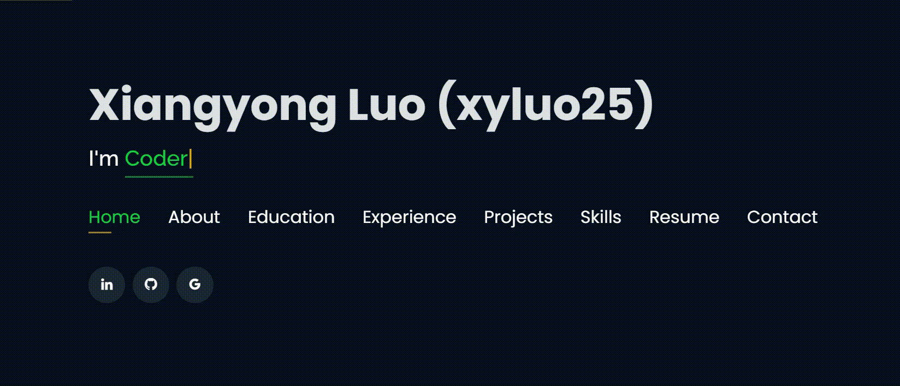
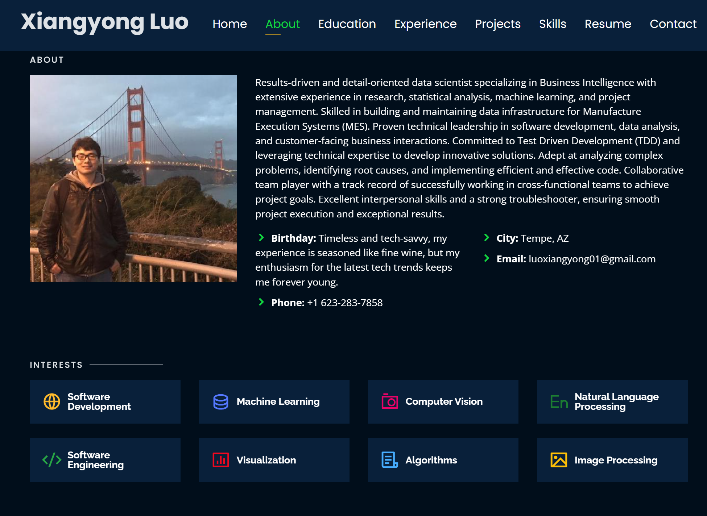
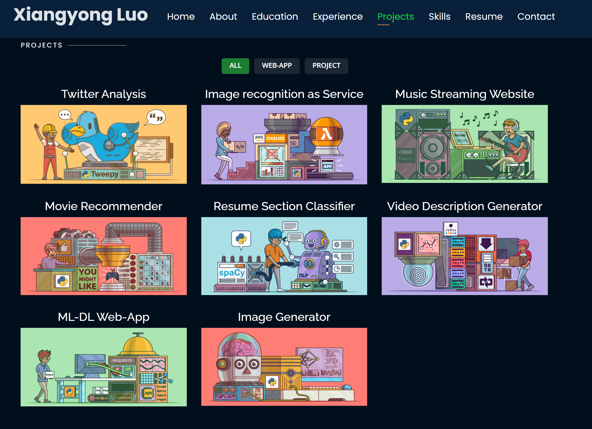

# Personal Portfolio 🔥

> https://xyluo25.github.io/

### Website Preview (Under Development)

#### Home Page

#### About Page

#### Projects Page

## Acknowledgement

The template adapted from: https://github.com/rajaprerak/rajaprerak.github.io

## TODO

1. [ ] Need to update the About page
2. [ ] Need to update the Education page
3. [ ] Need to update the Experience page
4. [ ] Need to update the Projects page
5. [ ] Need to update the Skills page

## License

- **[MIT license](http://opensource.org/licenses/mit-license.php)**
